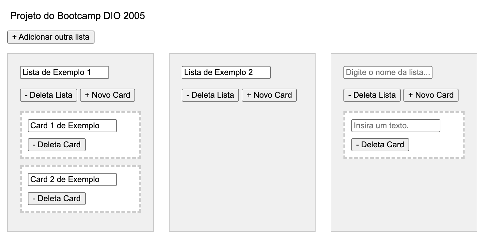

# Board de Tarefas com Java.

Este repositório corresponde ao projeto de Board de tarefas com Java para o Bootcamp Decola Tech 2025.

# Alguns esclarecimentos.

No projeto original do professor ele cria uma aplicação Java console para interagir com as funcionalidades de manipulação das entidades deste Board de cards. 
O Board contém um nome e uma lista de cards. Cada lista possui um nome e cada card possui um texto. Os cards podem ser movidos entre listas. É possível alterar o nome do Board, alterar o nome de Listas de cards, deletar listas de cards, criar nova listas de cards, incluir novo card em uma lista de cards, remover um card de uma lista de cards e alterar o texto do card.

No projeto original foi utilizado DAO, porém o DAO pelo que entendi é muito antigo, então fiz meu backend respeitando o formato mais recente de trabalho com persistência que é usando repositórios do Spring.

O frontend foi quase 80% feito com auxilio de inteligência artificial já que o foco desse projeto é o backend. 

